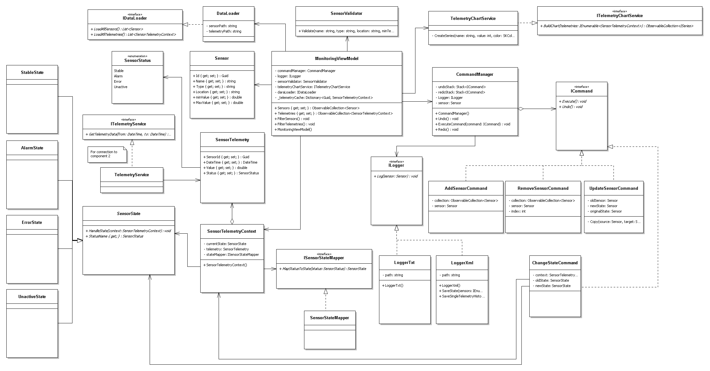
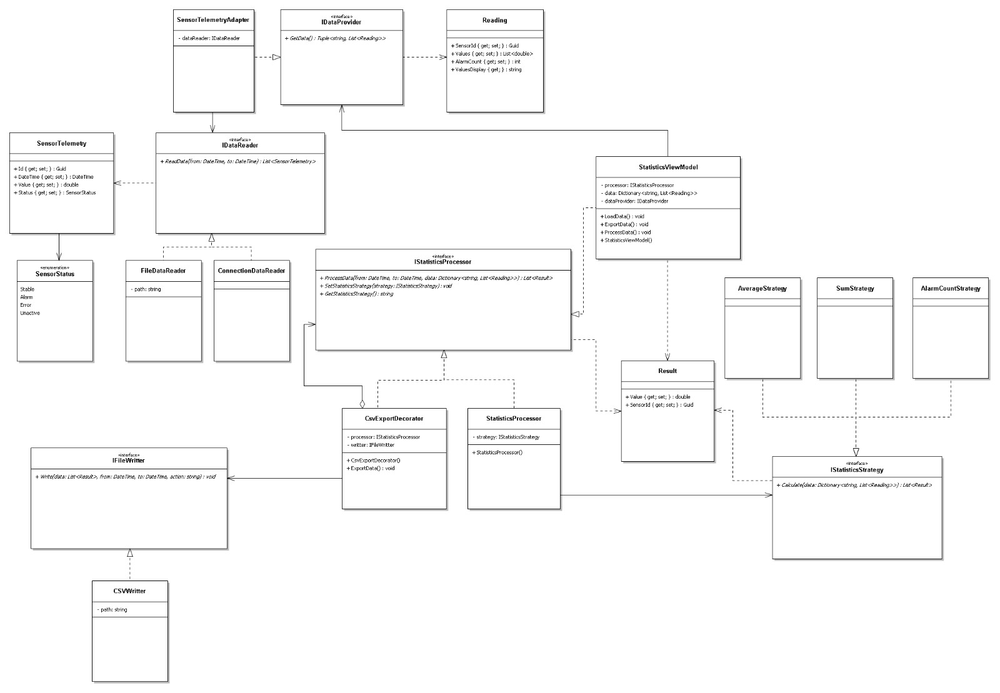
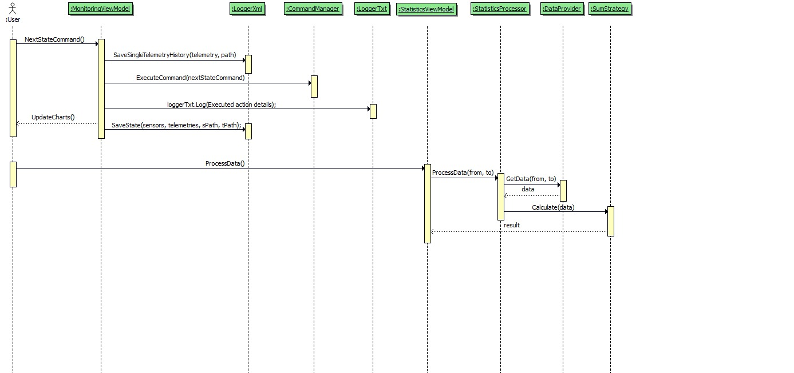

# IOT sensor monitoring system

This project involves the development of a distributed system consisting of two connected components that communicate using **Windows Communication Foundation (WCF)** technology. 
The application is developed using **WPF (Windows Presentation Foundation)** and follows the **MVVM (Model-View-ViewModel)** design pattern.

## System Overview

### Component 1: Information System
The Information System manages core data (Sensors and Sensor Metrics).

**Key Features:**
* **CRUD Operations:** Create, Read, Update, and Delete functionality.
* **Filter & Validation:** Advanced filter across all attributes and strict data validation before saving.
* **Undo/Redo:** Implementation of undo/redo functionality for data operations.
* **Logging:** All user activities are logged to a text file (including timestamp and description).
* **Simulation:** Real-time simulation of sensor state changes (Stable, Alarm, Error, Unactive).
* **Visualization:** Real-time charting of sensor states using **LiveCharts**.
* **Persistence:** Ability to save/load data using **XML** format.

### Component 2: Statistical Data Processing
This component retrieves data from Component 1 to perform analysis.

**Key Features:**
* **Data Aggregation:** Organizes data into a list keyed by a date range.
* **Statistical Methods:**
    * Average readings for the period.
    * Total readings per sensor for the period.
    * Frequency of a sensor being in an "Alarm" state.
* **Export:** Option to export statistical results into **CSV** files.

## Technical Requirements
* **Architecture:** Multi-tier, adhering to **SOLID** principles.
* **Communication:** WCF.
* **Pattern:** MVVM.
* **UI Library:** LiveCharts for data visualization.
* **Clean Code:** Follow C# naming conventions, separate concerns (Model, View, ViewModel, Services, etc.).
---
# UML Class diagram - Component1

# UML Class diagram - Component2

# Sequence Diagram describing the sensor reading reception and processing scenario

